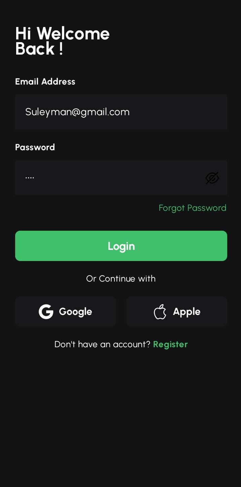
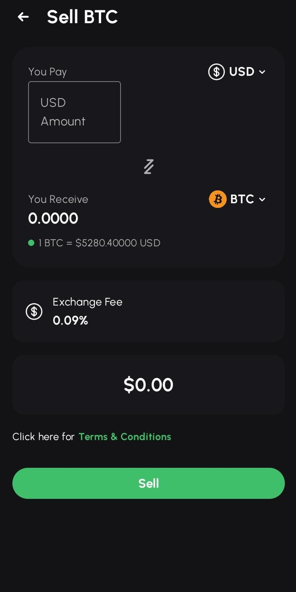
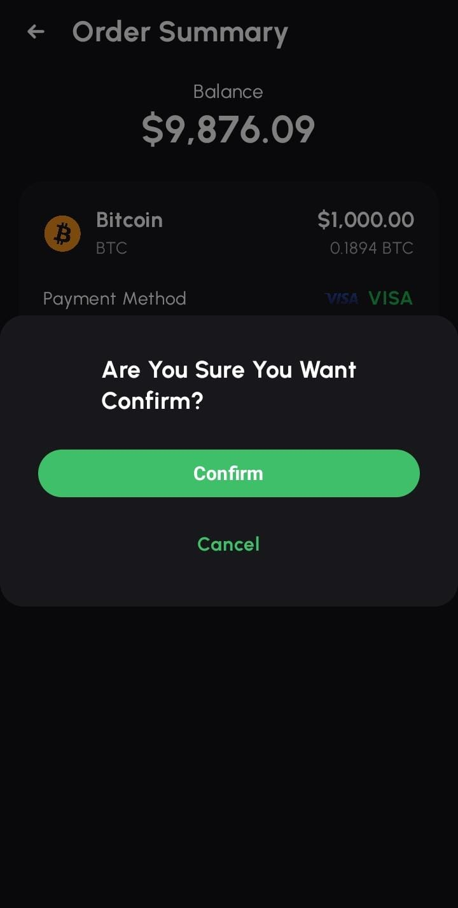
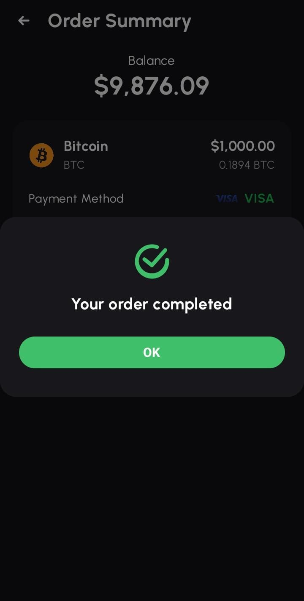
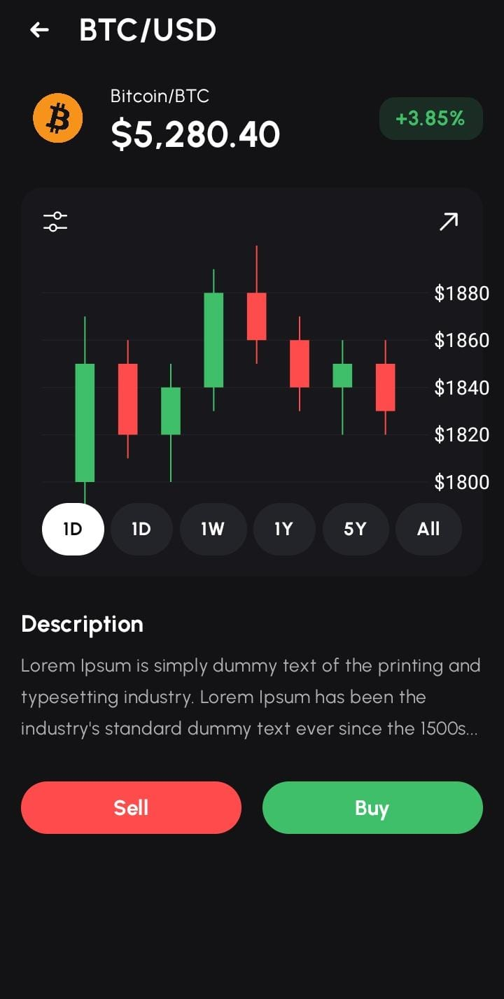
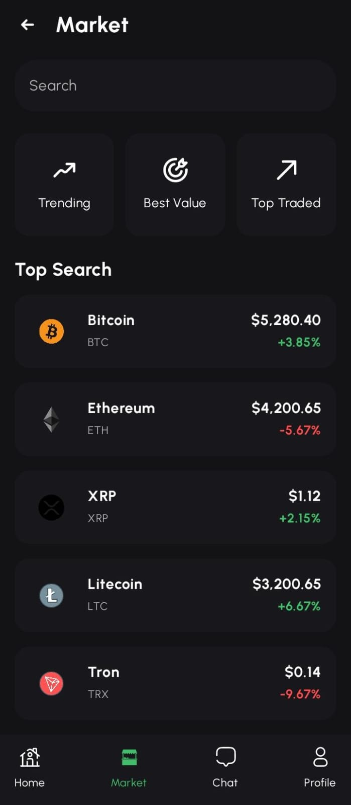
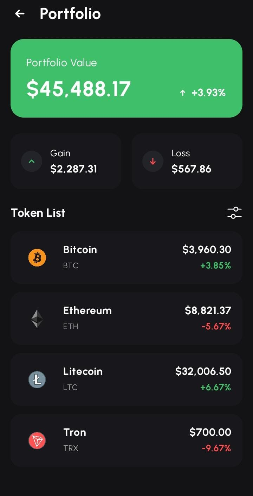

# CryptoAI Android App

A modern Android application that combines cryptocurrency functionality with AI features. Built with Kotlin and Jetpack Compose.

## Features

- 🔐 Secure Authentication
- 💬 AI-Powered Chat Interface
- 📊 Cryptocurrency Portfolio Management
- 💱 Real-time Exchange Rates
- 📱 Modern Material Design UI
- 🔄 Real-time Updates

## Tech Stack

- Kotlin
- Jetpack Compose
- MVVM Architecture
- Material Design 3
- AndroidX Libraries
- ViewModel & LiveData

## Getting Started

1. Clone the repository
2. Open the project in Android Studio
3. Sync Gradle files
4. Run the app on your device or emulator

## Contributing

Contributions are welcome! Please feel free to submit a Pull Request.

## License

This project is licensed under the MIT License - see the LICENSE file for details.

## Contact

Suleyman02025 - iwho7181@gmail.com

Project Link: [https://github.com/Suleyman02025/CryptoAI](https://github.com/Suleyman02025/CryptoAI)

## Screenshots

Here are some screenshots of the CryptoAI Android application:

<table>
  <tr>
    <td align="center">
      <h3>Splash Screen</h3>
      
    </td>
    <td align="center">
      <h3>Intro Screen 1</h3>
      
    </td>
  </tr>
  <tr>
    <td align="center">
      <h3>Intro Screen 2</h3>
      
    </td>
    <td align="center">
      <h3>Login Screen</h3>
      
    </td>
  </tr>
  <tr>
    <td align="center">
      <h3>Home Screen</h3>
      
    </td>
    <td align="center">
      <h3>Market Screen</h3>
      
    </td>
  </tr>
  <tr>
    <td align="center">
      <h3>Trending Screen</h3>
      
    </td>
    <td align="center">
      <h3>AI Chat Screen</h3>
      
    </td>
  </tr>
  <tr>
    <td align="center">
      <h3>Coin Detail Screen</h3>
      
    </td>
    <td align="center">
      <h3>Sell BTC - Empty</h3>
      
    </td>
  </tr>
  <tr>
    <td align="center">
      <h3>Sell BTC - Filled</h3>
      
    </td>
    <td align="center">
      <h3>Order Summary - Confirm</h3>
      
    </td>
  </tr>
  <tr>
    <td align="center">
      <h3>Order Summary - Completed</h3>
      
    </td>
    <td align="center">
      <h3>My Orders</h3>
      
    </td>
  </tr>
  <tr>
    <td align="center">
      <h3>Profile Screen</h3>
      
    </td>
    <td align="center">
      <h3>Profile - Logout Confirmation</h3>
      
    </td>
  </tr>
  <tr>
    <td align="center">
      <h3>Portfolio Screen</h3>
      
    </td>
    <td align="center">
      <h3>Payment Method</h3>
      
    </td>
  </tr>
  <tr>
    <td align="center">
      <h3>Saved Cards</h3>
      
    </td>
    <td></td>
  </tr>
</table> 